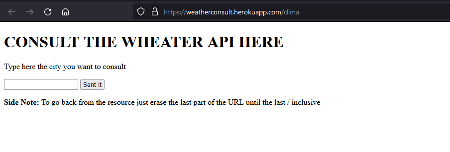
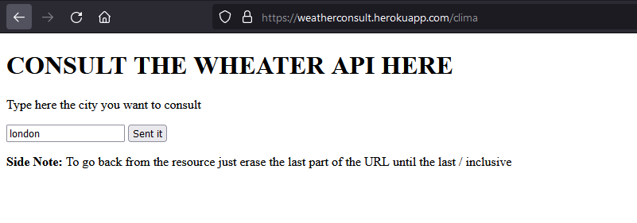
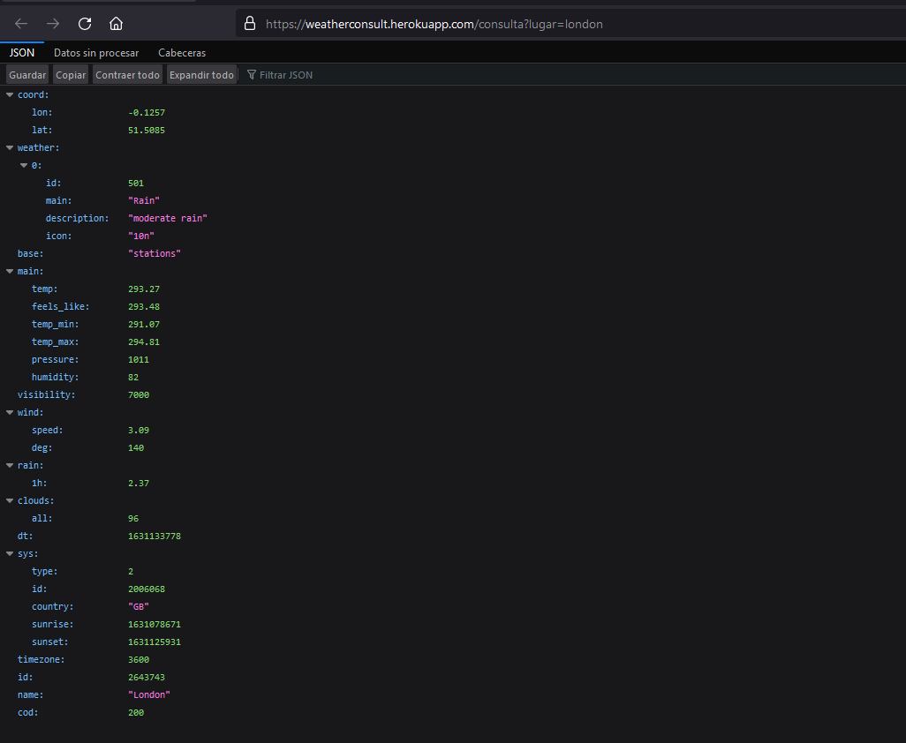

# PARCIAL 1 AREP

La aplicación debe consultar el estado del clima en lugares específicos de la tierra.  La aplicación recibirá en un campo la descripción de una ciudad, por ejemplo “London” para Londres   y deberá mostrar la información del clima para esa ciudad. Para esto utilice el API gratuito de https://openweathermap.org/ (Puede crear una cuenta para obtener la llave para realizar consultas). La petición debe pasar por su servicio web desplegado en Heroku, es decir desde su servicio en Heroku se debe invocar el servicio web de clima. El usuario no sabrá qué servicio está usted invocando por detrás. Utilice el servicio "Current Weather Data" de openweathermap.org.
## Comenzando 🚀

A continuación se presentarán series de instrucciones para que se pueda tener un funcionamiento en maquina local del proyecto


### Pre-requisitos 📋

Para el correcto funcionamiento en un ambiente de desarrollo se deberán tener instaladas las siguientes tecnologías:  
* [Git](https://git-scm.com/) - Software de control de versiones
* [Java 8](https://www.java.com/es/download/ie_manual.jsp) - Entorno de desarrollo
* [Maven](https://maven.apache.org/) - Manejador de dependencias

### Instalación 🔧

1. **Clonar el proyecto**
    ```
    git clone https://github.com/AngieMeG/AREP-T02
    ```
2. **Compilar el proyecto**
    ```
    mvn package
    ```
3. **Ejecutar la aplicación**  
    * Para entornos Windows
        ```
        java -cp "target/classes;target/dependency/*"  edu.escuelaing.arep.HttpServer
        ``` 
    * Para entornos Unix
        ```
        java $JAVA_OPTS -cp target/classes:target/dependency/*  edu.escuelaing.arep.HttpServer
        ```
4. **Servicio Web**  
Para observar la pagina web se debera escribir la siguiente URL en el browser de preferencia
    ```
    http://localhost:35000/clima
    ```
Y para hacer una consulta se debera pone lo siguiente
    ```
    http://localhost:35000/consulta?lugar={ciudad o lugar}
    ```
## Ejecutando las pruebas ⚙️

Para la ejecución de las pruebas
```
mvn test
```

## Ejecución
Se tiene una pagina para probar el servidor en el que se tiene un input para que el usuario ingrese la ciudad que desea consultar, si se le da al boton de enviar se redireccionará a la URL que se tiene para manejar la consulta y se podra observar la respuesta del API en formato JSON



# Despliegue 📦
[](https://weatherconsult.herokuapp.com/clima)
El despliegue de la aplicación se encuentra en [HTTP-SERVER](https://weatherconsult.herokuapp.com/clima)

## Construido con 🛠️

* [Maven](https://maven.apache.org/) - Manejador de dependencias
* [JQuery](https://jquery.com/) - Libreria JavaScript para el manejo del DOM
* [JUnit](https://junit.org/junit5/) - Herramienta para pruebas unitarias en Java

## Documentación 📖
Para generar la documentación
```
mvn javadoc:javadoc
```

Haga click [AQUI](./Documentacion/apidocs/index.html) para ver la documentación

## Autores ✒️

* **Angie Tatiana Medina Gil**

## Licencia 📄

Este proyecto está bajo la Licencia GNU General Public License mire el archivo [LICENSE.md](LICENSE.md) para detalles
